<div align="center">
<h1>Visage</h1>
Meetups done right
</div>

<hr1>

<p align="center">
    <!--
    <a href="https://github.com/HackerspaceMumbai/Visage/actions/workflows/ci.yml">
        
        </a>
        -->
        <a href="https://github.com/HackerspaceMumbai/Visage/releases">
        
        </a>
        <a href="https://github.com/HackerspaceMumbai/Visage/issues">
        
        </a>
        <a href="https://github.com/HackerspaceMumbai/Visage/blob/main/LICENSE">
        
        </a>
        <a href="https://github.com/HackerspaceMumbai/Visage">
        
        </a>
</p>

## The problem


We are the largest Open Source Software[OSS] community with its longest running(> 10 years) tech meetup in Bombay. Most of our events are houseful.

1. We have to curate the registrants based on the theme and also to ensure we are inclusive, diverse, and have a good mix of attendees.
2. We have to ensure that the attendees are checked-in to the event and also to the individual sessions. This is important for us to understand the attendee interest and also to ensure that we are able to provide the best experience to the attendees. Most importantly, we need to record the checkout time so as to comply with building/civic code.
3. With [DPDP](https://www.meity.gov.in/writereaddata/files/Digital%20Personal%20Data%20Protection%20Act%202023.pdf) (India's equivalent of GDPR) coming into effect, we have to ensure that the data we collected is secure, is not misused, and resides within the jurisdiction of India.

## The solution

We will build a solution on the latest .NET version, that takes full advantage of AI and Azure services to solve the problem. The solution will have the following components:

1. Aspire
2. Microsoft .NET AI extensions
3. Blazor Hybrid Web App
4. Azure Open AI

For further reading on architecture, please check our website [here](https://hackmum.in)

## Testing Guidelines

Since this is an Aspire based solution we are predominantly doing Integration testing  using TUnit, Fluent Assertions, & Playwright. We will strive to have 100% test coverage. External connections are mocked via NSubstitute, and load testing by NBomber. We will also include security testing using OWASP ZAP and Stryker for chaos.

Below are the guidelines for writing and running tests:

### Running Unit Tests

Unit testing is restricted for crucial Blazor Hybrid components using bunit.
Unit testing is restricted for crucial Blazor Hybrid components using bunit.

### Running Integration Tests

To run the integration tests, execute the following command:

```bash
dotnet test tests/Visage.Tests.Integration/Visage.Tests.Integration.csproj
```

### Configurable Tests

Our tests are configurable to run on different endpoints for local workstations and CI/CD environments. Ensure you have the appropriate configuration set in your environment variables.

### Writing New Tests

When writing new tests, follow these guidelines:

- Use TUnit and FluentAssertions for unit and integration tests.
- Use Playwright for end-to-end tests.
- Ensure tests are clear, maintainable, and cover critical functionalities.
- Document any new tests added to the suite.

For more detailed instructions and examples, refer to the test project files in the `tests` directory.

By following these guidelines, we can ensure that our codebase remains reliable, maintainable, and of high quality.

## Project Architecture and Components

The Visage project is built using a modular architecture to ensure scalability, maintainability, and ease of development. Below is an overview of the project's architecture and its main components:

The following diagram illustrates how the components of Visage interact with each other and how data flows through the system

Detailed Diagram:

```mermaid

flowchart TD

        %% Define the user and their interactions
    User(["User"])
    %% Top layer: User Interfaces
    subgraph "User Interfaces" 
        direction TB
        WebClient["Blazor Hybrid Web Client"]:::client
        WebServer["Blazor Web (server-hosted)"]:::client
        MAUI[".NET MAUI Mobile/Desktop App"]:::client
        SharedUI["Shared UI Library"]:::client
    end

    %% Middle layer: AppHost
    AppHost["Visage.AppHost"]:::aspire

    %% Lower layer: Microservices
    subgraph "Microservices"
        direction TB
        Eventing["Visage.Services.Eventing"]:::aspire
        Registrations["Visage.Services.Registrations"]:::aspire
        Cloudinary["Cloudinary Image Signing (Node.js)"]:::aspire
    end

    %% Bottom layer: Data Stores
    subgraph "Data Stores"
        direction TB
        EventDB[(EventDB)]:::data
        RegistrantDB[(RegistrantDB)]:::data
    end

    %% Bottom layer: External Services
    subgraph "External Services"
        direction TB
        AzureAI["Azure AI Foundry"]:::azure
        AzureContainer["Azure Container Apps"]:::azure
        Insights["Azure Monitor & App Insights"]:::azure
        CloudinaryStorage["Cloudinary"]:::azure
    end

    %% Connections
    User -->|Interacts with| WebClient
    User -->|Interacts with| WebServer
    User -->|Interacts with| MAUI

    WebClient -->|"HTTPS/REST"| AppHost
    WebServer -->|"HTTPS/REST"| AppHost
    MAUI -->|"HTTPS/REST"| AppHost
    WebClient -->|"HTTPS/REST"| Cloudinary
    WebServer -->|"HTTPS/REST"| Cloudinary
    MAUI -->|"HTTPS/REST"| Cloudinary

    AppHost -->|"HTTP/REST"| Eventing
    AppHost -->|"HTTP/REST"| Registrations
    AppHost -->|"Node Hosting Extension"| Cloudinary

    Eventing -->|"EF Core"| EventDB
    Registrations -->|"EF Core"| RegistrantDB

    AppHost -->|"Azure SDK"| AzureAI
    Eventing -->|"Azure SDK"| AzureAI
    Registrations -->|"Azure SDK"| AzureAI

    AppHost ---|"Containerized"| AzureContainer
    Eventing ---|"Containerized"| AzureContainer
    Registrations ---|"Containerized"| AzureContainer
    Cloudinary ---|"Containerized"| AzureContainer

    AppHost -->|"Monitoring"| Insights
    Eventing -->|"Monitoring"| Insights
    Registrations -->|"Monitoring"| Insights
    Cloudinary -->|"Monitoring"| Insights

    Cloudinary -->|"Media Storage"| CloudinaryStorage

    %% Dependencies
    WebClient --> SharedUI
    WebServer --> SharedUI
    MAUI --> SharedUI

    %% Legend
    subgraph Legend
        direction TB
        F["Rectangles: Frontend"]:::client
        S["Rounded: Services"]:::aspire
        D["Cylinders: Databases"]:::data
        C["Cloud: External Services"]:::azure
    end

    %% Click Events
    click WebClient "https://github.com/hackerspacemumbai/visage/blob/main/Visage.FrontEnd/Visage.FrontEnd.Web.Client"
    click WebServer "https://github.com/hackerspacemumbai/visage/blob/main/Visage.FrontEnd/Visage.FrontEnd.Web"
    click MAUI "https://github.com/hackerspacemumbai/visage/blob/main/Visage.FrontEnd/Visage.FrontEnd"
    click SharedUI "https://github.com/hackerspacemumbai/visage/blob/main/Visage.FrontEnd/Visage.FrontEnd.Shared"
    click AppHost "https://github.com/hackerspacemumbai/visage/blob/main/Visage.AppHost"
    click Eventing "https://github.com/hackerspacemumbai/visage/blob/main/services/Visage.Services.Eventing"
    click Registrations "https://github.com/hackerspacemumbai/visage/blob/main/services/Visage.Services.Registrations"
    click Cloudinary "https://github.com/hackerspacemumbai/visage/tree/main/services/CloudinaryImageSigning"

    %% Styling (matching your TB diagram)
    %% Top layer: User Interfaces
    subgraph "User Interfaces" 
        direction TB
        WebClient["Blazor Hybrid Web Client"]:::client
        WebServer["Blazor Web (server-hosted)"]:::client
        MAUI[".NET MAUI Mobile/Desktop App"]:::client
        SharedUI["Shared UI Library"]:::client
    end

    %% Middle layer: AppHost
    AppHost["Visage.AppHost"]:::aspire

    %% Lower layer: Microservices
    subgraph "Microservices"
        direction TB
        Eventing["Visage.Services.Eventing"]:::aspire
        Registrations["Visage.Services.Registrations"]:::aspire
        Cloudinary["Cloudinary Image Signing (Node.js)"]:::aspire
    end

    %% Bottom layer: Data Stores
    subgraph "Data Stores"
        direction TB
        EventDB[(EventDB)]:::data
        RegistrantDB[(RegistrantDB)]:::data
    end

    %% Bottom layer: External Services
    subgraph "External Services"
        direction TB
        AzureAI["Azure AI Foundry"]:::azure
        AzureContainer["Azure Container Apps"]:::azure
        Insights["Azure Monitor & App Insights"]:::azure
        CloudinaryStorage["Cloudinary"]:::azure
    end

    %% Connections
    User -->|Interacts with| WebClient
    User -->|Interacts with| WebServer
    User -->|Interacts with| MAUI

    WebClient -->|"HTTPS/REST"| AppHost
    WebServer -->|"HTTPS/REST"| AppHost
    MAUI -->|"HTTPS/REST"| AppHost
    WebClient -->|"HTTPS/REST"| Cloudinary
    WebServer -->|"HTTPS/REST"| Cloudinary
    MAUI -->|"HTTPS/REST"| Cloudinary

    AppHost -->|"HTTP/REST"| Eventing
    AppHost -->|"HTTP/REST"| Registrations
    AppHost -->|"Node Hosting Extension"| Cloudinary

    Eventing -->|"EF Core"| EventDB
    Registrations -->|"EF Core"| RegistrantDB

    AppHost -->|"Azure SDK"| AzureAI
    Eventing -->|"Azure SDK"| AzureAI
    Registrations -->|"Azure SDK"| AzureAI

    AppHost ---|"Containerized"| AzureContainer
    Eventing ---|"Containerized"| AzureContainer
    Registrations ---|"Containerized"| AzureContainer
    Cloudinary ---|"Containerized"| AzureContainer

    AppHost -->|"Monitoring"| Insights
    Eventing -->|"Monitoring"| Insights
    Registrations -->|"Monitoring"| Insights
    Cloudinary -->|"Monitoring"| Insights

    Cloudinary -->|"Media Storage"| CloudinaryStorage

    %% Dependencies
    WebClient --> SharedUI
    WebServer --> SharedUI
    MAUI --> SharedUI

    %% Legend
    subgraph Legend
        direction TB
        F["Rectangles: Frontend"]:::client
        S["Rounded: Services"]:::aspire
        D["Cylinders: Databases"]:::data
        C["Cloud: External Services"]:::azure
    end

    %% Click Events
    click WebClient "https://github.com/hackerspacemumbai/visage/blob/main/Visage.FrontEnd/Visage.FrontEnd.Web.Client"
    click WebServer "https://github.com/hackerspacemumbai/visage/blob/main/Visage.FrontEnd/Visage.FrontEnd.Web"
    click MAUI "https://github.com/hackerspacemumbai/visage/blob/main/Visage.FrontEnd/Visage.FrontEnd"
    click SharedUI "https://github.com/hackerspacemumbai/visage/blob/main/Visage.FrontEnd/Visage.FrontEnd.Shared"
    click AppHost "https://github.com/hackerspacemumbai/visage/blob/main/Visage.AppHost"
    click Eventing "https://github.com/hackerspacemumbai/visage/blob/main/services/Visage.Services.Eventing"
    click Registrations "https://github.com/hackerspacemumbai/visage/blob/main/services/Visage.Services.Registrations"
    click Cloudinary "https://github.com/hackerspacemumbai/visage/tree/main/services/CloudinaryImageSigning"

    %% Styling (matching your TB diagram)
    classDef azure fill:#0072C6,color:white,stroke:#0072C6
    classDef client fill:#7FBA00,color:white,stroke:#7FBA00
    classDef data fill:#FFB900,color:black,stroke:#FFB900
    classDef aspire fill:#F25022,color:white,stroke:#F25022,rx:10,ry:10
    classDef aspire fill:#F25022,color:white,stroke:#F25022,rx:10,ry:10
```



### 1. Aspire

Aspire is the core framework that powers the Visage project. It provides the foundation for building scalable and reliable applications. Aspire includes features such as dependency injection, configuration management, logging, and more.

### 2. Microsoft Extension for AI

The Microsoft Extension for AI is responsible for handling natural language processing (NLP) tasks within the Visage project. It leverages advanced machine learning models to understand and process user inputs, enabling intelligent interactions and responses. For more complex scenarios, the Semantic Kernel could be used.

### 3. Blazor Hybrid Web App

Blazor Hybrid is the front-end framework used in the Visage project. It allows for building interactive web applications using C# and .NET. Blazor Hybrid provides a seamless development experience by enabling code sharing between the client and server, and it supports running Blazor components in native mobile and desktop applications.

### 4. Azure Open AI

Azure Open AI is integrated into the Visage project to leverage the power of artificial intelligence. It provides advanced AI capabilities, such as natural language understanding, image recognition, and predictive analytics. Azure Open AI enables the Visage project to deliver intelligent and personalized experiences to users.

### 5. Minimal APIs

Minimal APIs are used in the Visage project to create lightweight and efficient HTTP services. Scalar OpenAPI is used to define and document the APIs, making it easy to consume and integrate with other systems. APIs are connected to the backend data store using EF Core. Most APIs will have an accompanying .http file for testing.

## Deployment Process

The deployment process for the Visage project involves the following steps:

1. **Build**: The project is built using the .NET SDK. This step compiles the source code and generates the necessary artifacts for deployment.

2. **Containerization**: Since this is an Aspire solution, for local development, services are containerized using Docker/Podman. Docker images are created for each component of the Visage project, ensuring consistency and portability across different environments. And these services are deployed via AZD as individual Azure Container Apps

3. **Infrastructure Provisioning**: The necessary infrastructure is provisioned using Azure services. This includes setting up virtual machines, databases, storage accounts, and other resources required for the Visage project.

4. **Configuration**: The deployed components are configured with the necessary environment variables, secrets, and connection strings. This ensures that the Visage project can connect to the required services and operate correctly.

5. **Monitoring and Logging**: The deployed components are monitored using Azure Monitor and Application Insights. This allows for real-time monitoring of the application's performance, availability, and health. Logs are collected and analyzed to identify and troubleshoot any issues.

6. **Security and Compliance**: Security measures are implemented to protect the Visage project from threats and vulnerabilities. This includes setting up firewalls, encryption, access controls, and compliance with data protection regulations.

7. **Testing**: The deployed components are tested to ensure that they are functioning correctly and meeting the required performance criteria. This includes functional testing, load testing, security testing, and other types of testing as needed.

8. **Deployment**: The final step involves deploying the built and tested components to the production environment. This includes updating DNS records, configuring load balancers, and ensuring that the application is accessible to users.
  

8. **Deployment**: The final step involves deploying the built and tested components to the production environment. This includes updating DNS records, configuring load balancers, and ensuring that the application is accessible to users.
  
By following this deployment process, the Visage project can be reliably deployed and maintained in a production environment.

## Further Reading

For more detailed information about the Visage project, please refer to the following resources:

- [Project Wiki](https://github.com/HackerspaceMumbai/Visage/wiki)
- [Project Website](https://hackmum.in)

These resources provide additional documentation, tutorials, and guides to help you get started with the Visage project and understand its architecture and components.
