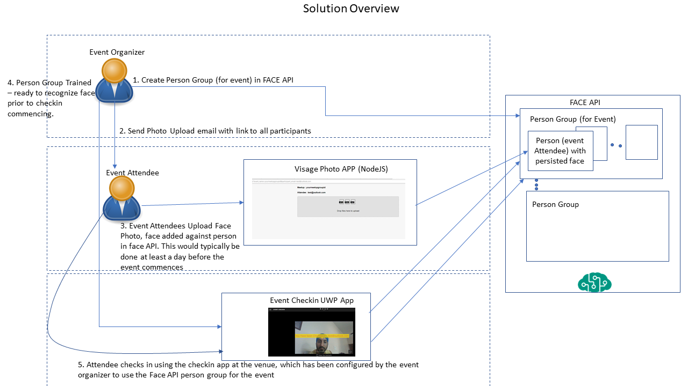
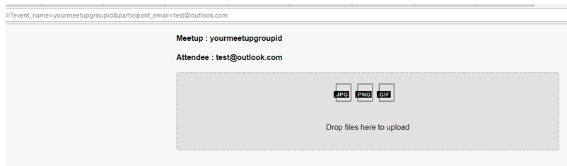
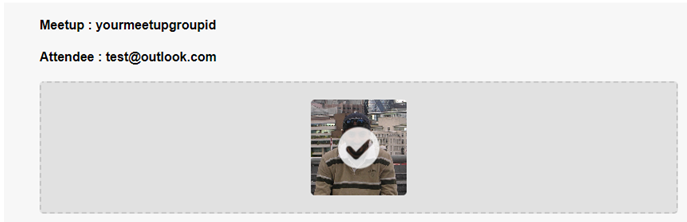
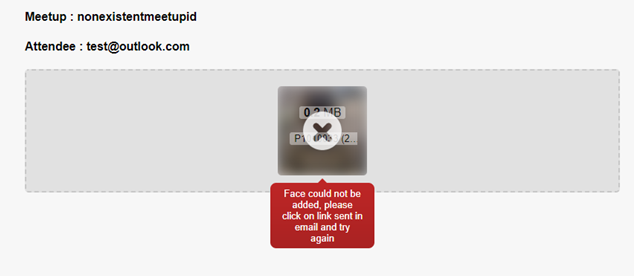
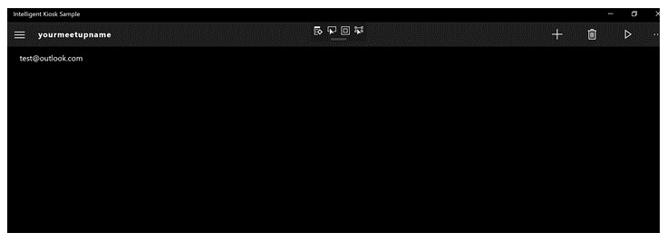
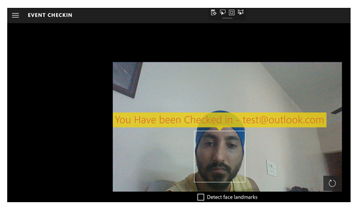

<div align="center">    
<h1>Visage</h1>
Meetup Checkins done right      
</div>

<hr1>

[![PRs Welcome][prs-badge]][prs]

## The problem
We run the largest and longest running community meetup in Bombay. While our meetups are free, we maintain strict RSVP etiquette and any missed checkins would adversely affect the attendees for future meetups. Also the biggest bottleneck for the checkins was the organizer himself since only his mobile app could be used for checking in attendees. 

## The solution

Simple: let the attendees self checkin. 
So the geeks that we were, we decided to use our super powers to build a solution that incorporates some exciting and powerful technologies including amongst others: Face Recognition, microservices based architecture and the latest front end technologies like React, Next.js, Graphql etc 


## Solution Overview


The solution has 4 main components :
* FACE API : The visage of every registrant is stored in the Microsoft Face API and then is used to make a determination during event checkins if there is a match for the face 
* Photo App : This is a containerized NodeJS App that exposed an API that uploads attendees photos into the Face API
* Checkin App : This UWP app which is expected to run on a desktop or tablet where the attendee peers into 
* Attendee App : The Xamarin app where folks can checkin into individual session

## Key setup and configuration steps

### Create Face API person group for event
* Person Group is the FACE API entity which logically corresponds to a event for which we want to checkin attendees. 
* First we need to get Face API Key from Azure Portal. Follow steps shown in [Get Face API key from Azure portal](http://www.c-sharpcorner.com/article/how-to-create-microsoft-cognitive-service-face-api-in-azure-portal/) to get your free or standard tier FACE API key.
* Now we create a person group for your event. The [FACE API reference](https://westus.dev.cognitive.microsoft.com/docs/services/563879b61984550e40cbbe8d/operations/563879b61984550f30395236) gives details of the RESTFUL FACE API. Code below shows how we can use curl to create a person group for our event. We need to substitute values for "yourmeetupgroupid" , "YourFaceAPISubscriptionKey" , "yourmeetupname" and "other-meetup-meta-data"

    ```sh
    curl -X PUT   https://westus.api.cognitive.microsoft.com/face/v1.0/persongroups/yourmeetupgroupid   -H 'cache-control: no-cache'   -H 'content-type: application/json'   -H 'ocp-apim-subscription-key: YourFaceAPISubscriptionKey'     -d '{
        "name":"yourmeetupname",
        "userData":"other-meetup-meta-data"
    }'
    ```

### Setup the nodejs/react based visage photo app
The attendees use this application to upload their photos. The services/photo folder is the root folder for this application. The application can optionally be configured for eventbrite authentication.


##### **Visage Photo Application Configuration**
The following environment variables need to be configured
* FACE_API_KEY : is needed by this application to persist face information for attendees in the FACE API. We got the FACE API Key in the "Create Face API person group for event" step
* APP_DOMAIN_NAME : This is an optional parameter, which is required if eventbrite authentication is to be configured. The is the full url of you applications domain. example "https://www.testdomain.com"
* LOGIN_WITH_SERVICE_URI : This is an optional parameter, which is required if eventbrite authentication is to be configured. Authentication integration with eventbrite is configured integrating with the [login-with](https://github.com/MumbaiHackerspace/login-with) . This is the full url of your login-with service endpoint. This subdomain will have the same doamin as the  APP_DOMAIN_NAME. example "https://login.testdomain.com"


##### **Executing the Automated tests for visage photo app**
  Automated tests for the photos app are under the /test folder
To run all tests you can execute command below. Note the Face API is needed for a subset of the tests to execute successfully
  ```sh
   gulp test --FACE_API_KEY <your-face-api-key>
  ```
  Alternately you execute tests per module as shown below
  ```sh
  mocha --grep Authentication-Tests
  ```


##### **Containerized Execution**
* The docker container image for this application is built each time there is a new merge in the https://github.com/maniSbindra/Visage repositories develop branch, and all automated tests pass (gulp test). You will find the latest image at https://hub.docker.com/r/maninderjit/visage/tags/ 
* You can the docker container image can be run as follows (you will need to replace values for face api key, app domain name and the login with service url):
  ```sh
  docker run -d -p 8080 
  -e FACE_API_KEY=<your face api key> 
  -e APP_DOMAIN_NAME="https://www.your-domain.com" 
  -e LOGIN_WITH_SERVICE_URI="https://login.your-domain.com"    
  maninderjit/visage:1057
  ```


##### **Inviting Event Participants to self register/upload their face images**
* Once this web application is configured, up and running, The attendees need to be sent links via emails in the format below. "yourmeetupgroupid" in the link needs to be replaced by person group id created in the "Create Face API person group for event" step , and the participant_email needs to be replaced by the email id of the attendees, which off course will be different for all attendees
    ```
    https://YourAppFQDN/?event_name=yourmeetupgroupid&participant_email=attendeesemail@test.com
    ```
* If eventbrite authentication is configured then participant_email or id does not need to be provided, the participant id is automatically fetched from eventbrite. The link in this case will in the format 
  ```sh
  https://YourAppFQDN/?event_name=yourmeetupgroupid
  ```
    User would be redirected to eventbrite and after the oauth flow is complete the participant id will be known.
* The rendered page will look like

  

##### Attendees Upload their face photo
* On successfull upload attendees will see a tick mark as shown in the image below 

  

* On failures, which can happen when person group with event_name does not exist in the FACE API, error is displayed in the format below

  


### Installing and configuring the the UWP Checkin-app prior to checkin commencing
* This application is a modified version of the [KIOSK APP](https://github.com/Microsoft/Cognitive-Samples-IntelligentKiosk)
* The checkin-app solution can be loaded in visual studio 2015 or 2017. Once loaded the UWP app can be run
* In default configuration checkins are logged into file eventlog.txt in the pictures folder, so this file needs to be created.
* Once App is loaded we need to go Settings from the Menu and add the "FACE API Key"
* Next from the Menu we need to go into FACE Identification setup from the menu. We should see the person group created for the event. On clicking the person group we should see the name of participants who have registered for the event. On the screen where we see the participants name we need to click the play icon to train the person group to recognize the faces of the registered participants. The training can also be done via the face API REST endpoints

  

##### Partipants checking in using face
* Click on the checkin app from the Menu
* Users can now start checking in using their face, by clicking on the camera icon. More than once participants can also checkin at a time

  

##### Adding custom logic on checkin
* You can edit the ./checkin-app/Controls/ImageWithFaceBorderUserControl.xaml.cs file. Search for TODO, you will see the following code. You can add your custom logic in the TODO section

```cs
    if (name is null)
    {
        faceUI.ShowCaptionMessage("Sorry could not identify attendee");
    }
    else
    {
        faceUI.ShowIdentificationData(age, gender, (uint)Math.Round(confidence * 100), name);

        // TODO Add code to mark attendee as checked in using <name>
        
        
    }
```
[prs-badge]: https://img.shields.io/badge/PRs-welcome-brightgreen.svg?style=flat-square  
[prs]: http://makeapullrequest.com


