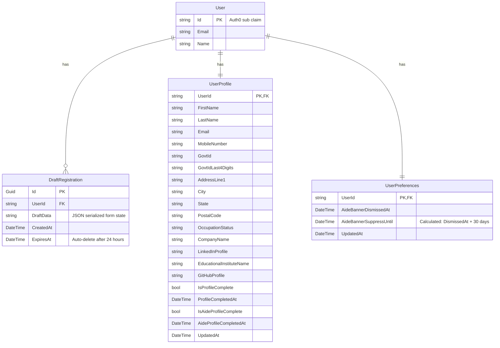
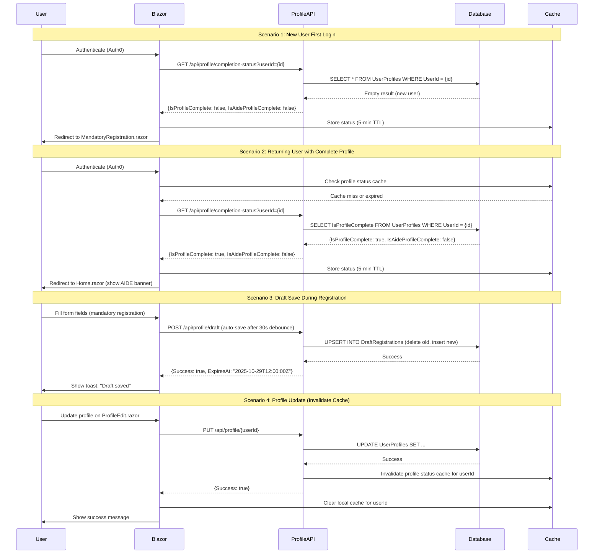

# Data Model: Registration Flow Optimization

**Branch**: `003-registration-flow-optimization` | **Date**: October 28, 2025
**Purpose**: Define database schema, entity relationships, and data flow for profile completion tracking and draft registration

**Note**: This file will be completed after Phase 0 research findings are documented in [research.md](./research.md).

## Entity Relationship Overview



## Entity Definitions

### UserProfile (Existing - Extend)

**Purpose**: Store user registration data including mandatory and optional (AIDE) fields

**Table Name**: `UserProfiles` (or `Registrants` if using existing table)

**Primary Key**: `UserId` (string, Auth0 sub claim)

**Columns**:

| Column Name | Type | Nullable | Default | Notes |
|------------|------|----------|---------|-------|
| UserId | string(255) | No | - | Foreign key to Auth0 user |
| FirstName | string(100) | No | - | Mandatory |
| LastName | string(100) | No | - | Mandatory |
| Email | string(255) | No | - | Mandatory (from Auth0 claim) |
| MobileNumber | string(20) | No | - | Mandatory |
| GovtId | string(50) | No | - | Mandatory (encrypted at rest) |
| GovtIdLast4Digits | string(4) | No | - | Mandatory (for display purposes) |
| AddressLine1 | string(255) | No | - | Mandatory |
| City | string(100) | No | - | Mandatory |
| State | string(100) | No | - | Mandatory |
| PostalCode | string(20) | No | - | Mandatory |
| OccupationStatus | string(50) | No | - | Mandatory (enum: Student, Professional) |
| CompanyName | string(255) | Yes | null | Conditional mandatory (if Professional) |
| LinkedInProfile | string(255) | Yes | null | Conditional mandatory (if Professional) |
| EducationalInstituteName | string(255) | Yes | null | Conditional mandatory (if Student) |
| GitHubProfile | string(255) | Yes | null | Conditional mandatory (if Student) |
| [AIDE fields...] | various | Yes | null | ~15-20 optional accessibility/inclusiveness fields |
| IsProfileComplete | bool | No | false | Computed: All mandatory fields present |
| ProfileCompletedAt | DateTime | Yes | null | First timestamp when IsProfileComplete = true |
| IsAideProfileComplete | bool | No | false | Computed: All AIDE fields present |
| AideProfileCompletedAt | DateTime | Yes | null | First timestamp when IsAideProfileComplete = true |
| CreatedAt | DateTime | No | NOW() | Auto-set on insert |
| UpdatedAt | DateTime | No | NOW() | Auto-update trigger |

**Indexes**:

- Primary Key: `UserId`
- Index on `IsProfileComplete` (for filtering incomplete profiles)
- Index on `Email` (for lookup by email)
- Index on `UpdatedAt` (for recent activity queries)

**Business Rules**:

- `IsProfileComplete` = true when all mandatory fields are non-null
- `IsAideProfileComplete` = true when all AIDE fields are non-null
- `ProfileCompletedAt` is set only once (first time `IsProfileComplete` becomes true)
- `AideProfileCompletedAt` is set only once (first time `IsAideProfileComplete` becomes true)

---

### DraftRegistration (New)

**Purpose**: Store partial registration progress for recovery within 24 hours

**Table Name**: `DraftRegistrations`

**Primary Key**: `Id` (Guid)

**Columns**:

| Column Name | Type | Nullable | Default | Notes |
|------------|------|----------|---------|-------|
| Id | Guid | No | NEWID() | Primary key |
| UserId | string(255) | No | - | Foreign key to Auth0 user |
| DraftData | text/json | No | - | JSON-serialized form state |
| CreatedAt | DateTime | No | NOW() | Auto-set on insert |
| ExpiresAt | DateTime | No | NOW() + 24h | Auto-delete trigger after this timestamp |

**Indexes**:

- Primary Key: `Id`
- Index on `UserId` (for user's latest draft lookup)
- Index on `ExpiresAt` (for cleanup job/trigger)

**Business Rules**:

- Only one draft per user (upsert logic: delete old draft before insert)
- Auto-delete after `ExpiresAt` timestamp via PostgreSQL TTL or cleanup job
- `DraftData` is encrypted at rest (application-level encryption before DB write)

**Example DraftData JSON**:

```json
{
  "firstName": "John",
  "lastName": "Doe",
  "email": "john.doe@example.com",
  "mobileNumber": "+91-9876543210",
  "occupationStatus": "Student",
  "lastUpdatedField": "occupationStatus",
  "completionPercentage": 45
}
```

---

### UserPreferences (New)

**Purpose**: Store user preferences including AIDE banner dismissal state

**Table Name**: `UserPreferences`

**Primary Key**: `UserId` (string, one-to-one with UserProfile)

**Columns**:

| Column Name | Type | Nullable | Default | Notes |
|------------|------|----------|---------|-------|
| UserId | string(255) | No | - | Foreign key to Auth0 user (one-to-one) |
| AideBannerDismissedAt | DateTime | Yes | null | Timestamp when user dismissed AIDE banner |
| CreatedAt | DateTime | No | NOW() | Auto-set on insert |
| UpdatedAt | DateTime | No | NOW() | Auto-update trigger |

**Indexes**:

- Primary Key: `UserId`
- Index on `AideBannerDismissedAt` (for filtering users who dismissed recently)

**Business Rules**:

- Banner is suppressed for 30 days after `AideBannerDismissedAt`
- Computed property `AideBannerSuppressUntil` = `AideBannerDismissedAt + 30 days`
- Banner shows again after 30 days or if AIDE profile is completed (whichever comes first)

---

## EF Core Entity Configurations

### ProfileCompletionStatus (Computed Property)

**Purpose**: Lightweight DTO for profile completion API response

**Not stored in database** - computed on-the-fly from `UserProfile` entity.

```csharp
public class ProfileCompletionStatusDto
{
    public required string UserId { get; init; }
    public required bool IsProfileComplete { get; init; }
    public required bool IsAideProfileComplete { get; init; }
    public DateTime? ProfileCompletedAt { get; init; }
    public DateTime? AideProfileCompletedAt { get; init; }
    public List<string>? IncompleteMandatoryFields { get; init; }
    public DateTime CheckedAt { get; init; } = DateTime.UtcNow;
}
```

**Computation Logic**:

```csharp
IsProfileComplete = FirstName != null 
                 && LastName != null 
                 && Email != null 
                 && MobileNumber != null 
                 && GovtId != null 
                 && GovtIdLast4Digits != null 
                 && AddressLine1 != null 
                 && City != null 
                 && State != null 
                 && PostalCode != null 
                 && OccupationStatus != null
                 && (OccupationStatus == "Student" 
                     ? (EducationalInstituteName != null && GitHubProfile != null)
                     : (CompanyName != null && LinkedInProfile != null));
```

---

## Migration Strategy

### Phase 1: Add New Tables

1. Add `DraftRegistrations` table
2. Add `UserPreferences` table
3. Add computed columns to `UserProfile`:
   - `IsProfileComplete` (computed column or indexed computed property in EF Core)
   - `ProfileCompletedAt`
   - `IsAideProfileComplete`
   - `AideProfileCompletedAt`

### Phase 2: Data Backfill

1. Backfill `IsProfileComplete` for existing users (run update query)
2. Set `ProfileCompletedAt` to `UpdatedAt` for users where `IsProfileComplete = true`
3. Backfill `IsAideProfileComplete` for existing users
4. Set `AideProfileCompletedAt` to `UpdatedAt` for users where `IsAideProfileComplete = true`

### Phase 3: Add Auto-Delete Trigger for DraftRegistrations

**PostgreSQL Function**:

```sql
CREATE OR REPLACE FUNCTION delete_expired_drafts()
RETURNS TRIGGER AS $$
BEGIN
    DELETE FROM DraftRegistrations WHERE ExpiresAt < NOW();
    RETURN NEW;
END;
$$ LANGUAGE plpgsql;

CREATE TRIGGER trigger_delete_expired_drafts
AFTER INSERT OR UPDATE ON DraftRegistrations
EXECUTE FUNCTION delete_expired_drafts();
```

**Alternative**: Use background job (Hangfire, Quartz.NET) to clean up expired drafts every hour.

---

## Data Flow Diagram



---

## Caching Strategy

### Client-Side Cache (Browser)

- **Storage**: Blazor ProtectedSessionStorage (InteractiveServer) or in-memory cache
- **Key**: `profile_status_{userId}`
- **TTL**: 5 minutes
- **Invalidation**:
  - On profile update (manual invalidation via ProfileService)
  - On cache expiration (auto)
  - On browser refresh (sessionStorage clears)

### Server-Side Cache (Optional)

- **Storage**: Distributed cache (Redis) or in-memory cache (IMemoryCache)
- **Key**: `profile_status_{userId}`
- **TTL**: 5 minutes
- **Invalidation**:
  - On profile update in ProfileAPI (manual `cache.Remove()`)
  - On cache expiration (auto)

**Decision**: Start with client-side cache only (simpler, lower server load). Add server-side cache if API latency becomes a bottleneck.

---

## Security Considerations

1. **Encrypted Fields**: `GovtId` must be encrypted at rest (use EF Core value converters or database-level encryption)
2. **Draft Data Encryption**: `DraftRegistration.DraftData` must be encrypted before storing in database
3. **Access Control**: All profile API endpoints require valid Auth0 JWT with `profile:read-write` scope
4. **Input Validation**: All API inputs validated via DataAnnotations + custom validators
5. **SQL Injection Protection**: Use parameterized queries (EF Core handles this)
6. **GDPR/DPDP Compliance**: Draft data auto-deletes after 24 hours (no indefinite retention)

---

## Next Steps

1. Implement EF Core entities and DbContext configuration
2. Create migration: `aspire exec --resource registrations -- dotnet ef migrations add AddProfileCompletionTracking`
3. Apply migration: `aspire exec --resource registrations -- dotnet ef database update`
4. Implement Repository pattern for profile completion queries
5. Create API contracts (contracts/profile-completion-api.yaml)
6. Update quickstart.md with local database setup instructions
