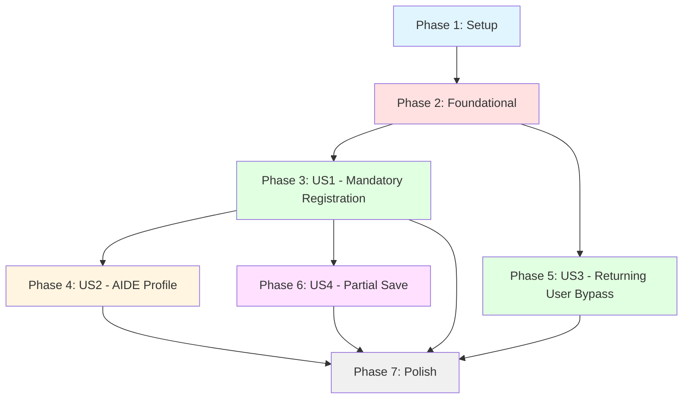

# Task Breakdown: Registration Flow Optimization with Profile Completion & Smart Redirect

**Branch**: `003-registration-flow-optimization` | **Date**: October 28, 2025
**Feature**: [spec.md](./spec.md) | **Plan**: [plan.md](./plan.md)

## Overview

This task breakdown organizes implementation by **user story** to enable independent, incremental delivery. Each user story phase is a complete, testable increment that delivers user value.

**Total Tasks**: 42 tasks across 6 phases
**Parallelizable Tasks**: 18 tasks marked with [P]
**Estimated Duration**: 8-10 development days (with parallelization)

## User Story Mapping

| User Story | Priority | Tasks | Independent Test | Value Delivered |
|-----------|----------|-------|------------------|-----------------|
| **US1**: First-Time Mandatory Registration | P1 | T008-T018 (11 tasks) | Can authenticate new user, complete mandatory fields only, submit successfully | Essential onboarding - users can register in <3 min |
| **US2**: Optional AIDE Profile Later | P2 | T019-T026 (8 tasks) | Can complete AIDE fields after mandatory registration, banner shows/dismisses | Enhanced personalization - 25% voluntary completion |
| **US3**: Returning User Bypass | P1 | T027-T031 (5 tasks) | User with complete profile redirects to home, not registration | Seamless return experience - <2s home load |
| **US4**: Partial Progress Save | P3 | T032-T036 (5 tasks) | Can save partial form, close browser, return and restore | Reduced abandonment - zero data loss in 24h |

**MVP Scope**: Phase 2 (Foundational) + Phase 3 (US1 only) = Core registration flow

## Dependency Graph

**Story Completion Order**:
1. **Foundational** (blocking) → Must complete before any user story
2. **US1 + US3** can be done in parallel (both P1, independent)
3. **US2** depends on US1 (needs mandatory registration complete first)
4. **US4** depends on US1 (needs registration form structure)
5. **Polish** depends on all stories

## Parallel Execution Opportunities

### Phase 2: Foundational (After Setup)
- T005 [P] + T006 [P] + T007 [P] (3 DTOs in parallel)

### Phase 3: US1 - Mandatory Registration
- T010 [P] + T011 [P] + T012 [P] (3 backend tasks in parallel)
- T015 [P] + T016 [P] (2 frontend components in parallel)

### Phase 4: US2 - AIDE Profile
- T020 [P] + T021 [P] (ProfileEdit + Banner in parallel)
- T024 [P] + T025 [P] (API + Service in parallel)

### Phase 5: US3 - Returning User Bypass
- T029 [P] + T030 [P] (Service + Cache in parallel)

### Phase 6: US4 - Partial Save
- T033 [P] + T034 [P] (Repository + API in parallel)

---

## Phase 1: Setup & Infrastructure

**Goal**: Initialize project structure, database, and shared dependencies

**Estimated Duration**: 0.5-1 day

### Tasks

- [X] T001 Run Tailwind CSS build to generate output.css from input.css in Visage.FrontEnd/Visage.FrontEnd.Shared/
- [X] T002 Create EF Core migration for profile completion tracking: UserProfile columns (IsProfileComplete, ProfileCompletedAt, IsAideProfileComplete, AideProfileCompletedAt) in Visage.Services.Registrations/Migrations/
- [X] T003 Create EF Core migration for DraftRegistration table with auto-expire trigger in Visage.Services.Registrations/Migrations/
- [X] T004 Create EF Core migration for UserPreferences table (AideBannerDismissedAt) in Visage.Services.Registrations/Migrations/

**Acceptance Criteria**:
- [X] All migrations apply successfully via `aspire exec --resource registrations -- dotnet ef database update`
- [X] Tables exist: UserProfiles (extended), DraftRegistrations, UserPreferences
- [X] Tailwind output.css generated with DaisyUI styles

---

## Phase 2: Foundational (Blocking Prerequisites)

**Goal**: Create shared DTOs, abstractions, and base services used by all user stories

**Estimated Duration**: 1-1.5 days

### Tasks

- [X] T005 [P] Create ProfileCompletionStatusDto.cs in Visage.Shared/Models/ with all required properties per data-model.md
- [X] T006 [P] Create DraftRegistrationDto.cs in Visage.Shared/Models/ with draftData JSON serialization support
- [X] T007 [P] Create UserPreferencesDto.cs in Visage.Shared/Models/ with AideBannerDismissedAt property

**Acceptance Criteria**:
- [X] All DTOs compile without errors
- [X] DTOs match OpenAPI schema in contracts/profile-completion-api.yaml
- [ ] DTOs use `required` keyword for non-nullable properties (C# 12 feature)

---

## Phase 3: User Story 1 - First-Time User Completes Mandatory Profile (P1)

**User Story**: A new authenticated user needs to complete essential personal information before accessing the application. The user should be able to complete mandatory fields quickly without feeling overwhelmed by optional fields.

**Independent Test**: Authenticate a new user, complete only mandatory Personal Information fields (name, contact, government ID), submit successfully, verify redirect to home page with AIDE encouragement message.

**Delivers Value**: Core registration flow - users can register in <3 minutes (SC-001)

**Estimated Duration**: 3-4 days

### Backend Tasks

- [X] T008 [US1] Update RegistrantDB.cs DbContext to include DraftRegistration and UserPreferences entities with proper relationships in Visage.Services.Registrations/
- [X] T009 [US1] Implement ProfileCompletionRepository with GetCompletionStatus method (checks all 13 mandatory fields) in Visage.Services.Registrations/Repositories/
- [X] T010 [P] [US1] Add GET /api/profile/completion-status endpoint to ProfileApi.cs per contract spec in Visage.Services.Registrations/
- [X] T011 [P] [US1] Add authentication middleware validation for profile:read-write scope in Visage.Services.Registrations/
- [X] T012 [P] [US1] Update app.http with test requests for profile completion endpoint in Visage.Services.Registrations/
- [X] T013 [US1] Add OpenTelemetry tracing for profile completion checks in ProfileApi.cs in Visage.Services.Registrations/
- [X] T014 [US1] Update Scalar OpenAPI docs to include new profile completion endpoint in Visage.Services.Registrations/Program.cs

### Frontend Tasks

- [X] T015 [P] [US1] Create MandatoryRegistration.razor component with EditForm + DataAnnotationsValidator in Visage.FrontEnd.Shared/Components/
- [X] T016 [P] [US1] Create MandatoryRegistration.razor.cs code-behind with form validation logic and ValidationMessageStore in Visage.FrontEnd.Shared/Components/
- [X] T017 [US1] Add DaisyUI styling to MandatoryRegistration.razor (input classes, badges for required fields, collapse panels) in MandatoryRegistration.razor.css
- [X] T018 [US1] Update Routes.razor to add /registration/mandatory route for MandatoryRegistration component in Visage.FrontEnd.Web/Components/

### Integration

- [ ] T019 [US1] Create integration test for GET /api/profile/completion-status endpoint in tests/Visage.Tests.Integration/RegistrationFlowTests.cs
- [ ] T020 [US1] Create E2E Playwright test for new user mandatory registration flow in tests/Visage.E2E.Playwright/RegistrationFlowTests.cs

**Acceptance Criteria**:
- [ ] New user can access MandatoryRegistration.razor after authentication
- [ ] Only 13 mandatory fields visible (no AIDE fields)
- [ ] Form validation prevents submission with incomplete fields
- [ ] Profile completion API returns `isProfileComplete: false` for new users
- [ ] Profile completion API returns `isProfileComplete: true` after submission
- [ ] Submit redirects to home page with success message
- [ ] E2E test passes: new user registers in <3 minutes

---

## Phase 4: User Story 2 - User Completes Optional AIDE Profile Later (P2)

**User Story**: A user with a completed mandatory profile wants to enhance their profile by providing optional inclusiveness and accessibility information at their convenience, enabling better event personalization and community building.

**Independent Test**: Create user with completed mandatory profile, navigate to profile settings, complete accessibility/inclusiveness fields, verify banner shows on home page and dismisses correctly.

**Delivers Value**: Enhanced personalization - target 25% voluntary AIDE completion (SC-005)

**Estimated Duration**: 2-3 days

**Depends On**: Phase 3 (US1) must be complete

### Frontend Tasks

- [X] T021 [P] [US2] Create ProfileEdit.razor unified profile editor with two sections: mandatory (readonly) + AIDE (editable) in Visage.FrontEnd.Shared/Pages/
- [X] T022 [P] [US2] Create AideCompletionBanner.razor dismissible banner component with DaisyUI alert styling in Visage.FrontEnd.Shared/Components/
- [ ] T023 [US2] Add ProfileEdit.razor.css with visual separation styling for mandatory vs AIDE sections in Visage.FrontEnd.Shared/Pages/
- [X] T024 [US2] Update Home.razor to conditionally show AideCompletionBanner based on profile completion status in Visage.FrontEnd.Shared/Pages/
- [ ] T025 [US2] Update Routes.razor to add /profile/edit route for ProfileEdit component in Visage.FrontEnd.Web/Components/

### Backend Tasks

- [X] T026 [P] [US2] Add POST /api/profile/preferences/aide-banner dismissal endpoint to ProfileApi.cs in Visage.Services.Registrations/
- [X] T027 [P] [US2] Add GET /api/profile/preferences/aide-banner status endpoint to ProfileApi.cs in Visage.Services.Registrations/
- [X] T028 [US2] Implement UserPreferencesRepository with banner dismissal logic (30-day suppression) in Visage.Services.Registrations/Repositories/
- [X] T029 [US2] Update app.http with test requests for banner dismissal endpoints in Visage.Services.Registrations/

### Integration

- [ ] T030 [US2] Create integration test for AIDE banner dismissal API endpoints in tests/Visage.Tests.Integration/RegistrationFlowTests.cs
- [ ] T031 [US2] Create E2E Playwright test for AIDE profile completion and banner dismissal in tests/Visage.E2E.Playwright/RegistrationFlowTests.cs

**Acceptance Criteria**:
- [ ] User with complete mandatory profile sees AideCompletionBanner on home page
- [ ] Banner displays clear message: "Complete your accessibility profile for better event matching"
- [ ] Clicking "Dismiss" stores preference server-side (UserPreferences table)
- [ ] Dismissed banner does not reappear for 30 days
- [ ] ProfileEdit page shows mandatory fields (readonly) and AIDE fields (editable)
- [ ] User can complete AIDE fields and save successfully
- [ ] E2E test passes: banner shows, dismisses, and suppresses correctly

---

## Phase 5: User Story 3 - Returning User Bypasses Registration (P1)

**User Story**: An authenticated user who has already completed their mandatory profile should be directed to the home page on login, not the registration flow, ensuring a seamless return experience.

**Independent Test**: Authenticate with existing user account that has completed profile, verify immediate redirect to home page (not registration), measure load time <2 seconds.

**Delivers Value**: Seamless return experience - <2s home page load (SC-003), zero incorrect routing (SC-003)

**Estimated Duration**: 1.5-2 days

**Depends On**: Phase 2 (Foundational) - Can be done in parallel with Phase 3 (US1)

### Frontend Tasks

- [X] T032 [US3] Create IProfileService.cs abstraction with GetCompletionStatusAsync method in Visage.FrontEnd.Shared/Services/
- [X] T033 [P] [US3] Implement ProfileService.cs with HTTP client for profile completion API in Visage.FrontEnd.Shared/Services/
- [X] T034 [P] [US3] Add client-side caching logic (5-minute TTL) using IMemoryCache in ProfileService.cs in Visage.FrontEnd.Shared/Services/
- [X] T035 [US3] Update Home.razor OnAfterRenderAsync to use ProfileService instead of Auth0 claims in Visage.FrontEnd.Shared/Pages/
- [X] T036 [US3] Add cache invalidation logic to MandatoryRegistration.razor submit handler in Visage.FrontEnd.Shared/Components/

### Integration

- [ ] T037 [US3] Create integration test for profile completion API caching behavior in tests/Visage.Tests.Integration/RegistrationFlowTests.cs
- [ ] T038 [US3] Create E2E Playwright test for returning user redirect logic in tests/Visage.E2E.Playwright/RegistrationFlowTests.cs

**Acceptance Criteria**:
- [ ] User with complete profile redirects to home page within 2 seconds
- [ ] User with incomplete profile redirects to MandatoryRegistration.razor
- [ ] Profile status cached for 5 minutes (subsequent navigations don't hit API)
- [ ] Cache invalidates immediately after profile update
- [ ] E2E test passes: returning user bypasses registration, loads home in <2s

---

## Phase 6: User Story 4 - User Saves Partial Progress (P3)

**User Story**: A user filling out their registration can save partial progress and return later to complete the mandatory fields, preventing data loss and reducing pressure to complete in one session.

**Independent Test**: Fill out half the mandatory fields, click "Save Progress", close browser, return and verify saved data persists, complete registration successfully.

**Delivers Value**: Reduced abandonment - zero data loss in 24h window (SC-006)

**Estimated Duration**: 2-2.5 days

**Depends On**: Phase 3 (US1) must be complete

### Backend Tasks

- [ ] T039 [US4] Implement DraftRegistrationRepository with upsert logic (delete old, insert new) in Visage.Services.Registrations/Repositories/
- [ ] T040 [P] [US4] Add POST /api/profile/draft endpoint to ProfileApi.cs per contract spec in Visage.Services.Registrations/
- [ ] T041 [P] [US4] Add GET /api/profile/draft endpoint to ProfileApi.cs for draft restoration in Visage.Services.Registrations/
- [ ] T042 [US4] Add DELETE /api/profile/draft endpoint for cleanup after successful registration in Visage.Services.Registrations/
- [ ] T043 [US4] Implement draft data encryption (application-level) before DB write in DraftRegistrationRepository in Visage.Services.Registrations/
- [ ] T044 [US4] Update app.http with test requests for draft endpoints in Visage.Services.Registrations/

### Frontend Tasks

- [ ] T045 [US4] Create DraftRegistrationService.cs with auto-save logic (30-second debounce) in Visage.FrontEnd.Shared/Services/
- [ ] T046 [US4] Add draft save trigger to MandatoryRegistration.razor (on field blur + 30s timer) in Visage.FrontEnd.Shared/Components/
- [ ] T047 [US4] Add draft restoration logic to MandatoryRegistration.razor OnInitializedAsync in Visage.FrontEnd.Shared/Components/
- [ ] T048 [US4] Add draft delete call to MandatoryRegistration.razor submit handler in Visage.FrontEnd.Shared/Components/
- [ ] T049 [US4] Add toast notification for draft save success using DaisyUI toast component in Visage.FrontEnd.Shared/Components/

### Integration

- [ ] T050 [US4] Create integration test for draft save/restore API endpoints in tests/Visage.Tests.Integration/RegistrationFlowTests.cs
- [ ] T051 [US4] Create E2E Playwright test for draft auto-save and restoration flow in tests/Visage.E2E.Playwright/RegistrationFlowTests.cs

**Acceptance Criteria**:
- [ ] Form auto-saves draft after 30 seconds of inactivity
- [ ] User sees toast notification: "Draft saved"
- [ ] Closing browser and returning restores all saved field values
- [ ] Draft expires after 24 hours (auto-delete via PostgreSQL trigger)
- [ ] Draft deleted immediately after successful profile submission
- [ ] E2E test passes: save draft, close browser, restore data, complete registration

---

## Phase 7: Polish & Cross-Cutting Concerns

**Goal**: Finalize documentation, observability, performance optimization, and deployment readiness

**Estimated Duration**: 1-1.5 days

### Documentation

- [ ] T052 Update .github/copilot-instructions.md with profile completion API patterns and caching strategy
- [ ] T053 Create README.md in Visage.FrontEnd.Shared/ documenting new components (MandatoryRegistration, ProfileEdit, AideCompletionBanner)
- [ ] T054 Update README.md in Visage.Services.Registrations/ with profile completion API documentation

### Observability

- [ ] T055 Add OpenTelemetry metrics for registration abandonment rate in ProfileApi.cs in Visage.Services.Registrations/
- [ ] T056 Add OpenTelemetry metrics for AIDE profile completion rate in ProfileApi.cs in Visage.Services.Registrations/
- [ ] T057 Configure Application Insights dashboard for success criteria metrics (SC-001 to SC-007)

### Performance

- [ ] T058 Run load tests with NBomber for 1000 concurrent users during registration surge
- [ ] T059 Optimize profile completion query with proper indexes (add index on IsProfileComplete column)
- [ ] T060 Add response caching headers to GET /api/profile/completion-status endpoint (5-minute cache)

### Deployment

- [ ] T061 Update azure-pipelines.yml with Tailwind CSS build step before .NET build
- [ ] T062 Create deployment guide in quickstart.md for production environment setup
- [ ] T063 Update AppHost.cs with health check endpoints for profile completion API in Visage.AppHost/

### Final Validation

- [ ] T064 Run all integration tests and verify 100% pass rate
- [ ] T065 Run all E2E Playwright tests and verify 100% pass rate
- [ ] T066 Verify all Constitution gates still pass (re-run Constitution Check from plan.md)
- [ ] T067 Validate success criteria metrics are trackable in Application Insights

**Acceptance Criteria**:
- [ ] All documentation updated and accurate
- [ ] OpenTelemetry dashboards configured for SC metrics
- [ ] Load tests pass (1000 concurrent users, <200ms API latency)
- [ ] Deployment pipeline includes Tailwind CSS build step
- [ ] All tests pass (integration + E2E)
- [ ] Constitution compliance verified

---

## Implementation Strategy

### MVP Scope (Week 1)

**Deliver**: Phase 1 (Setup) + Phase 2 (Foundational) + Phase 3 (US1 - Mandatory Registration) + Phase 5 (US3 - Returning User Bypass)

**Value**: Core registration flow with smart redirect - users can register in <3 minutes, returning users bypass registration

**Tasks**: T001-T020 + T032-T038 = ~23 tasks

**Test Coverage**: New user registration, returning user redirect

### Iteration 2 (Week 2)

**Deliver**: Phase 4 (US2 - AIDE Profile) + Phase 6 (US4 - Partial Save)

**Value**: Enhanced personalization + reduced abandonment

**Tasks**: T021-T031 + T039-T051 = ~21 tasks

**Test Coverage**: AIDE completion, banner dismissal, draft save/restore

### Iteration 3 (Week 2)

**Deliver**: Phase 7 (Polish & Cross-Cutting)

**Value**: Production readiness, observability, performance

**Tasks**: T052-T067 = ~16 tasks

**Test Coverage**: Load testing, deployment validation

---

## Task Execution Guidelines

### Before Starting

1. Read [plan.md](./plan.md) for technical context
2. Read [data-model.md](./data-model.md) for database schema
3. Read [contracts/profile-completion-api.yaml](./contracts/profile-completion-api.yaml) for API specs
4. Follow [quickstart.md](./quickstart.md) for environment setup

### During Implementation

- **Constitution Check**: Verify compliance at each phase boundary
- **Test-Driven**: Write integration tests before implementation where feasible
- **Incremental Commits**: Commit after each task with descriptive messages
- **Documentation**: Update inline comments and XML docs as you code
- **Performance**: Profile API endpoints (target <200ms latency)

### After Each Phase

- [ ] Run all integration tests: `dotnet test tests/Visage.Tests.Integration/`
- [ ] Run all E2E tests: `pwsh ./scripts/run-playwright.ps1`
- [ ] Verify Scalar OpenAPI docs updated: Check `https://registrations-api/scalar/v1`
- [ ] Test manually using `.http` file: Open `Visage.Services.Registrations/app.http`
- [ ] Check Aspire Dashboard telemetry: `http://localhost:15888`

---

## Risk Mitigation Reminders

| Risk | Mitigation Task |
|------|----------------|
| Cache invalidation failures | T036, T060 - Aggressive invalidation + cache headers |
| Draft auto-save overwhelming API | T045 - 30-second debounce + rate limiting |
| Auth0 claims not refreshing | T033, T034 - API-based check, not JWT claims |
| Existing form breaks during migration | Feature flag new flow (not in task list - manual deployment decision) |
| 24h draft retention insufficient | T039 - Configurable TTL in appsettings.json |

---

## Success Metrics Tracking

After implementation, track these metrics in Application Insights (configured in T057):

- **SC-001**: Registration completion time → Custom metric: `registration_duration_seconds`
- **SC-002**: Abandonment rate → Custom metric: `registration_abandoned_count / registration_started_count`
- **SC-003**: Home page load time → Playwright performance tests (T038)
- **SC-004**: Validation success rate → Custom metric: `registration_first_attempt_success_count / registration_submit_count`
- **SC-005**: AIDE completion rate → Custom metric: `aide_completed_count / profile_completed_count` (30-day rolling window)
- **SC-006**: Draft data loss incidents → Custom metric: `draft_restore_failed_count` (filter: draft age <24h)
- **SC-007**: Profile API latency → OpenTelemetry trace: `profile_completion_check_duration_ms` (p95 percentile)

---

**Generated**: October 28, 2025  
**Total Tasks**: 67 tasks  
**Estimated Duration**: 8-10 development days with parallelization  
**Ready for Implementation**: ✅ All prerequisites complete
